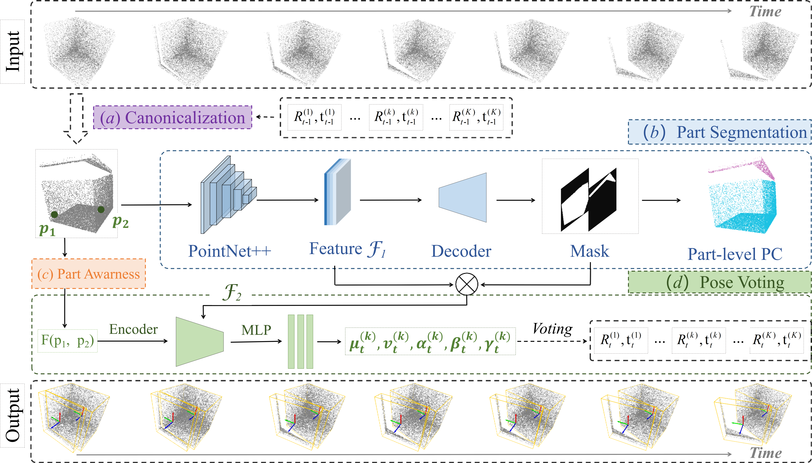

<h1 align="center">
VoCAPTER: Voting-based Pose Tracking for Category-level Articulated Object via Inter-frame Priors
</h1>
<p align='center'>
 </img>
</p>


<div align="center">
<h3>
<a href="https://zanly20.github.io">Li Zhang</a>,  Zean Han,  Yan Zhong, Qiaojun Yu, Xingyu Wu, Xue Wang,  Rujing Wang
<br>
<br>
ACM MM 2024
<br>
<br>
<a href='https://dl.acm.org/doi/abs/10.1145/3664647.3681131'>
  
</a>
<a href='https://zanly20.github.io'>
  
</a>
<br>
</h3>
</div>
> In this paper, we propose a novel framework, VoCAPTER, to conduct the category-level articulated object tracking task. Our method  first leverages the inter-frame priors to conduct adjacent pose increment estimation task. Afterward, we perform the segmentation  at per-part level and filter the noisy point pairs via proposed part  awareness. Finally, we use the SE(3)-invariant parameters to vote  for the pose at all t frames (t > 0). Empirical results demonstrate the  superiority of our VoCAPTER compared to state-of-the-art methods not only on the synthetic dataset but also on real-world scenarios,  which turns out to be a robust and real-time tracking framework.

# Overview

This is the official code implementation of VoCAPTER, including both training and testing. 

# Installation

You can run the following command to setup an environment, tested on Ubuntu 18.04:

<details>
<summary><b>Create Conda Env</b></summary>


```
conda create -n VoCAPTER python=3.8
```

</details>

<details>
<summary><b>Install Pytorch</b></summary>


```
conda install pytorch torchvision cudatoolkit=10.2 -c pytorch-lts
```

</details>

<details>
<summary><b>Install Other Dependencies</b></summary>


```
pip install tqdm opencv-python scipy matplotlib open3d==0.12.0 hydra-core pyrender cupy-cuda102 PyOpenGL-accelerate OpenEXR
CXX=g++-7 CC=gcc-7 pip install MinkowskiEngine==0.5.4 -v
```

</details>

<details>
<summary><b>Miscellaneous</b></summary>
Notice that we use pyrender with OSMesa support, you may need to install OSMesa after running ```pip install pyrender```, more details can be found [here](https://pyrender.readthedocs.io/en/latest/install/index.html).


``MinkowskiEngine`` append its package path into ``sys.path`` (a.k.a., PYTHONPATH), which includes a module named ``utils``. In order not to get messed with our own ``utils`` package, you should import ``MinkowskiEngine`` after importing ``utils``.
</details>

<details>
<summary><b>Quick installation:</b></summary>


```
conda create -n VoCAPTER python=3.8 -y
conda activate VoCAPTER
pip install -r requirements.txt
```


# Training

```
  python train.py
```


# Test

```python
  python test.py
```


# Citation

```
@inproceedings{zhang2024vocapter,
  title={Vocapter: Voting-based pose tracking for category-level articulated object via inter-frame priors},
  author={Zhang, Li and Han, Zean and Zhong, Yan and Yu, Qiaojun and Wu, Xingyu and Wang, Xue and Wang, Rujing},
  booktitle={Proceedings of the 32nd ACM International Conference on Multimedia},
  pages={8942--8951},
  year={2024}
}
```
